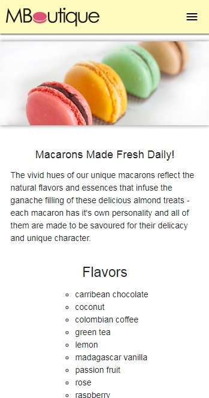

# M-Boutique

An online storefront for a French bakery that specialized in macarons!

##  Features

* A welcome page with a brief description of who they are and what they do as well as a schedule for daily samples.
* Macaron specific page that highlights the aroma of macarons, different flavors, and instructions on how to properly store macarons to retain flavor.
* Gifts and party page for large macaron orders and store speciality party towers for memoriable events.
* Contact page that contains store location, hours, and a contact form for inquries.

 | 
:-------------------------:|:-------------------------:

 | 
:-------------------------:|:-------------------------:

## Technology Used

* React
* JavaScript
* Redux-Form
* HTML5
* CSS3
* Materialize
* Flexbox

## Tools Used

* Git
* Github

